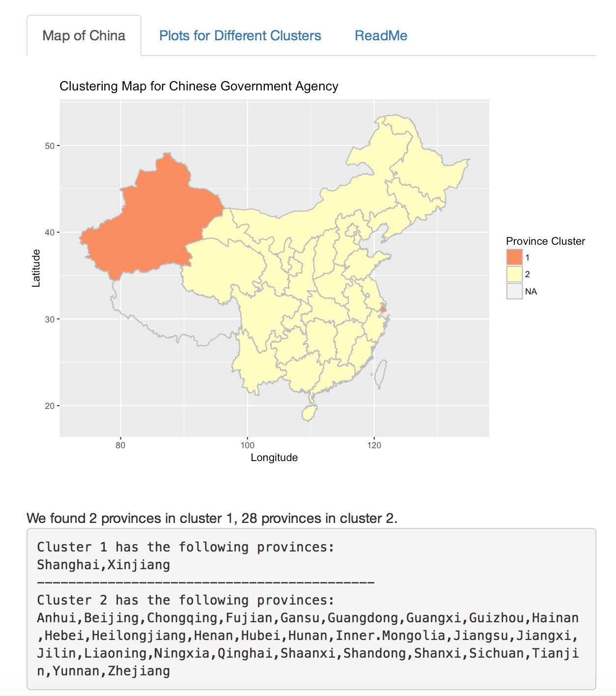
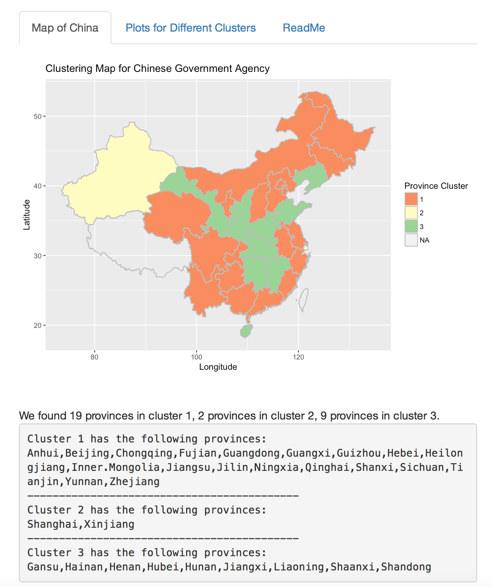
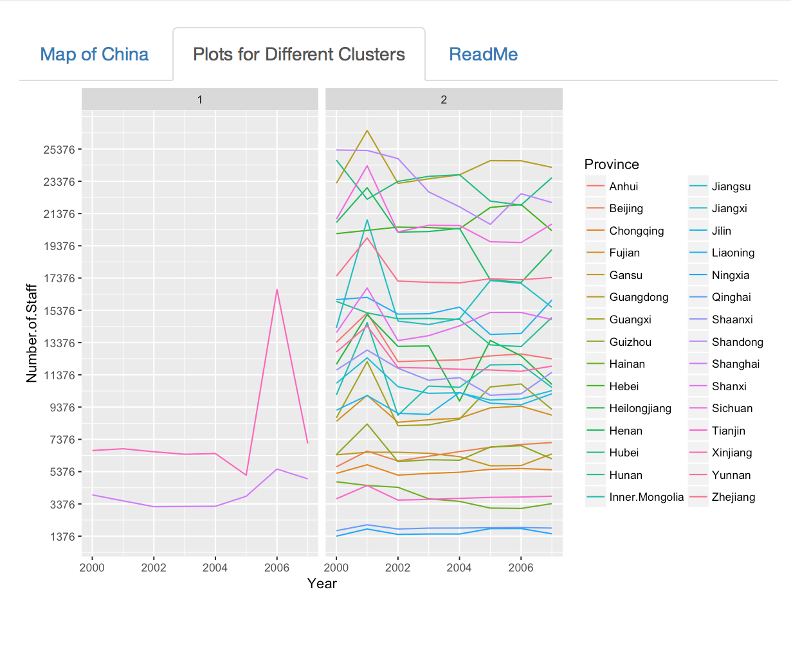
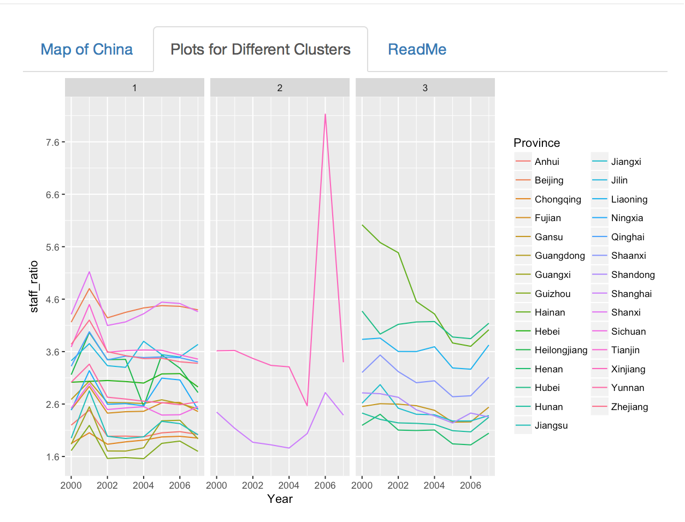

### Interpretation of Shiny App Results

#### Clustering Method

We perform a cluster analysis on both the total staff number and the normalized staff ratio (staff number/population). The clustering method is based on the result of Non-negative Matrix Factorization (NMF). NMF is a technique of decomposing a large matrix into the product of two smaller matrices and can be considered as a clustering method. The two smaller matrices contain information on the cluster patterns and weights respectively. For example, we assign an object to cluster 1 if it has the largest weight on cluster pattern 1 comparing to the weights on the other cluster patterns. The reason to provide the choice of clustering by the normalized staff ratio is to remove the absolute size effect that is captured by the total staff number. For example, some provinces may have a larger population thus having a larger staff number. The size difference between provinces becomes an dominating factor in the clsutering method. The normalized staff ratio is between 0 to 1 for all provinces thus is able to capture other useful features if interested. NMF has the property that both the input and results only contain non-negative elements. It is advantageous for our dataset because both the total staffing number and the normalized staff ratio contain non-negative numbers only.

#### Map of China Panel

From the *Map of China* panel, we may visualize the clustering result on the map, the number of provinces and the province names in each cluster. As shown by Fig???, different clusters are marked by different colors, and provinces marked by the same colour belong to the same cluster. Sometimes the map shows a cluster of NA and the corresponding region is shaded gray in the map. It is because the original dataset does not contain information on certain provinces and we mark them as "not available". The table below the map shows the names of the provinces in each cluster. As we change the filters on the left-side panel, the clustering map and the table change correspondingly. For example, as shown by Fig????, when we change the number of cluster to 3 clusters, the map shows three different colors representing three clusters. The table below change accordingly to show province names in these three clusters.

#### Trend Plot Panel

The *Plots for Different Clusters* panel contains trend plots for different provinces from 2000 to 2007 and is partitoned by different clusters. The clusters and provinces in each cluster is the same as shown in the *Map of China* panel. For example, in Fig??? we demonstrate the clustering result with the choices of *2 clusters, LTB and Total Staffing Number*. We see that *Xinjiang* and *Shanghai* belong to cluster 1 and all the other provinces belong to cluster 2. In Fig?????, the trend plots for *Xinjiang* and *Shanghai* and plotted together on the left-side under cluster 1, and the trend plots for all the other provinces are plotted on the right-side under cluster 2. The trend plots are designed to visualize how different clusters behave differently. From Fig?????, we observe that the two provinces in cluster 1 both have a flat line between 2000 to 2005 and a peak in 2006. The other provinces in cluster 2 seem to have a common peak in 2001 and a period of decrease between 2004 to 2006. We may note that some of the provinces plotted in cluster 2 (the few lines in the bottom) seem to be flat during the whole period. It indicates that 3 clusters could be more appropriate, depending on the investigator's preference over the pre-specified number of clusters to look at. As another exmple, fig?????? shows the clsutering result with the choices of *3 clusters, LTB and Staff Ratio*. We obvserve that provinces in cluster 1 seem to have a common peak between 2000 to 2002; provinces in clsuter 2 seem to have a peak in 2006; provinces in cluster 3 seem to have a decrease between 2004 to 2006.

